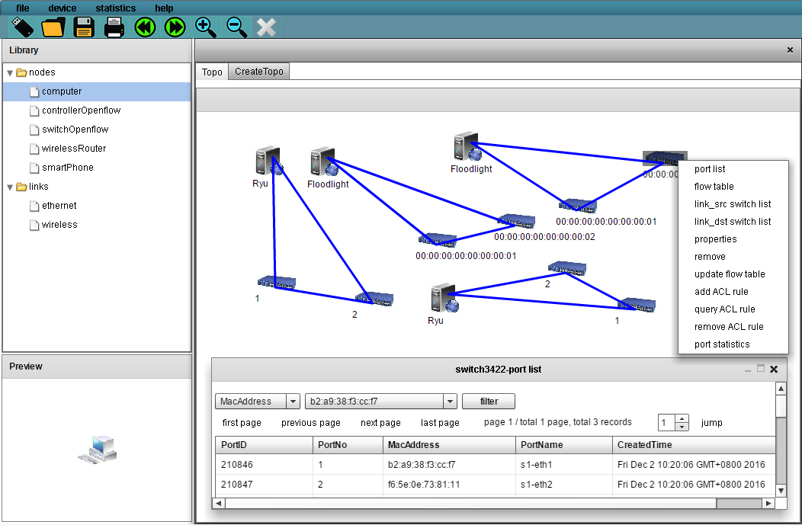

## Overview

The sdnbox is a openflow based network management platform, developed by vnetlab team in dlut. You can manipulate any in-ready openflow network on the platform, just make sure your network's controller API be compatible with sdnbox. The sdnbox so far works fine with controllers like floodlight and ryu, supporting OpenFlow 1.0 protocol.

## Features

1. manipulate underlying openflow network.
2. create custom network experiment script.

## Catalog

1. sdnbox_deployable: providing compiled deployable version.
2. sdnbox_resource: providing platform required resource, such as dbscript and ofcontroller.
3. sdnbox_source: providing version of source code, can be re compiled.
